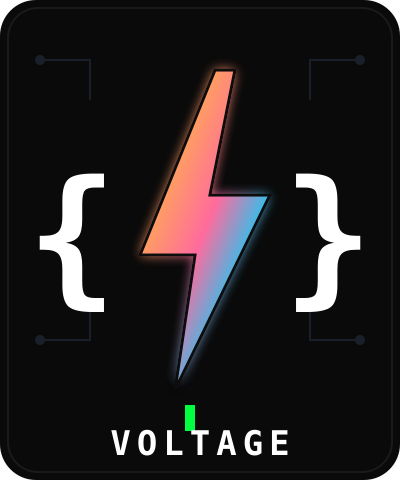
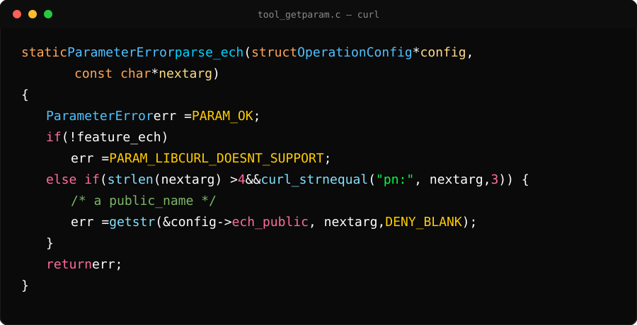
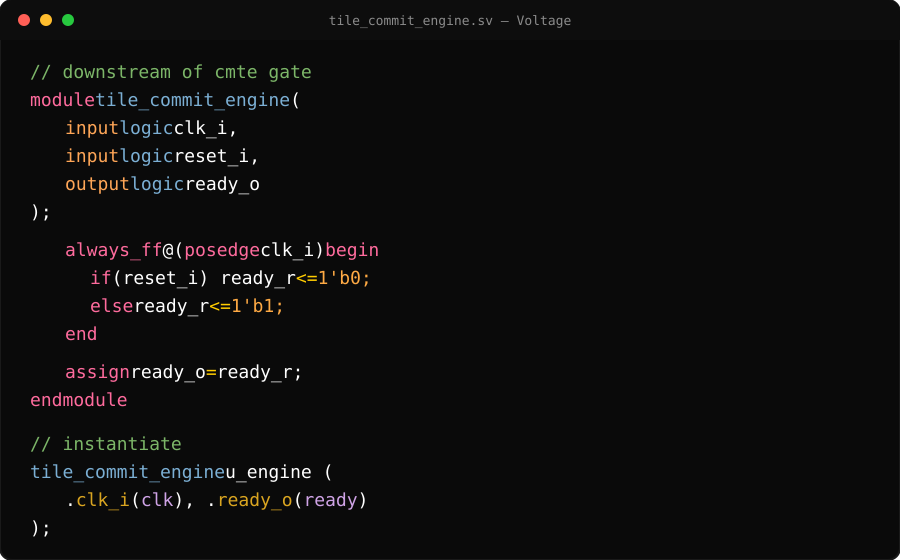
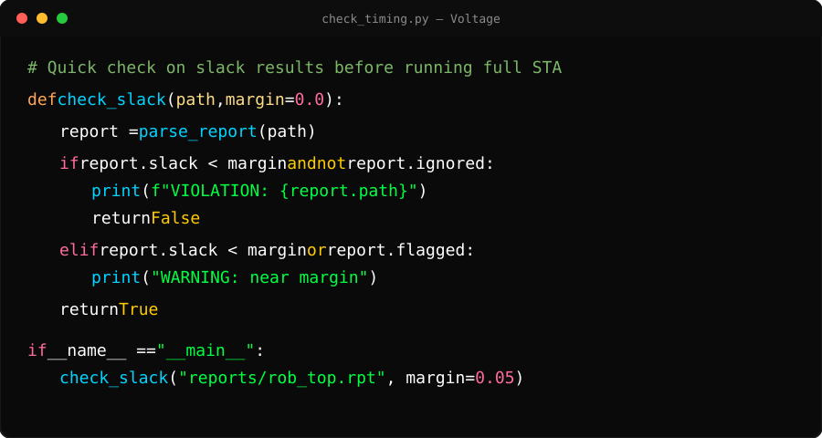

# Voltage

Voltage is a high-contrast, vibrant dark VS Code theme, which I might expand to other tools as well. 

This project originated with my dissatisfaction with every color theme I seemed to find. I could never get the right combination of colors that I found to be helpful in identifying code and visually pleasing. 

So, I made **Voltage** - No dimming, no washed out colors, but a rich set of vibrant colors against a clean dark background with customization throughout for different languages. 

<p align="center">
  
</p>

## Structure

```
voltage/
├── vscode/
│   ├── package.json
│   └── themes/
│       └── voltage-color-theme.json
├── bash/
│   └── .bashrc
├── docs/
│   └── palette.md
├── img/
│   ├── voltage-logo.svg
│   ├── preview-c.svg
│   ├── preview-sv.svg
│   └── preview-python.svg
├── LICENSE
└── README.md
```

Each tool gets its own top-level folder. The palette itself is documented once, in `docs/palette.md`, rather than duplicated per app.

## Installation

**VS Code:**

Grab the packaged extension from [Releases](https://github.com/VerdantLeaf/voltage-theme/releases) and install it with:

```
code --install-extension voltage-theme-1.0.1.vsix
```

Or install manually from the file: `Ctrl+Shift+P` → "Extensions: Install from VSIX..." → select the `.vsix`.

Then `Ctrl+Shift+P` → "Preferences: Color Theme" → select **Voltage**.

To build the `.vsix` yourself:

```
cd vscode
npx @vscode/vsce package
```

**Recommended settings:**

I recommend extending the theme with rainbow bracket-pair guides. However, these need to be turned on by hand in your own `settings.json` (colorization itself, `editor.bracketPairColorization.enabled`, is already `true` by default in modern VS Code):

```json
{
  "editor.guides.bracketPairs": true
}
```

Voltage doesn't bundle its own file icons, but if you have the [Material Icon Theme](https://marketplace.visualstudio.com/items?itemName=PKief.material-icon-theme) extension installed, these are the folder/file tint colors used alongside Voltage:

```json
{
  "workbench.iconTheme": "material-icon-theme",
  "material-icon-theme.folders.color": "#F56600",
  "material-icon-theme.files.color": "#522DB0"
}
```

**Bash:**
Grab what you'd like from `bash/.bashrc` and drop it into `~/.bashrc` — More for my personal uses

## Palette

See [`docs/palette.md`](docs/palette.md) for the full color table.

## Preview

**C** — excerpt from [curl](https://github.com/curl/curl):

<p align="center">
  
</p>

**SystemVerilog:**

<p align="center">
  
</p>

**Python** — excerpt from [omlx](https://github.com/jundot/omlx):

<p align="center">
  
</p>

> The listed previews are mockups with code from different open source projects

## Language-specific notes

- **C/C++**: struct/object member access (e.g. `x` in `threadIdx.x`) is colored separately from the base identifier.
- **SystemVerilog**: port declarations (`input`, `output`, `logic`) follow the type/parameter color scheme; struct field access matches the C struct-access color; plain signals default to white.
- **Tcl**: commands match function color, variables are white, flags/options are orange, control keywords are pink-red.
- **Python**: `and` / `or` / `not` in conditionals get their own gold color, matching enums/macros.

## License

MIT — see [LICENSE](LICENSE).

## Notes

This is a living theme — colors get adjusted as new languages or edge cases come up. Check the commit history for the latest tweaks.
