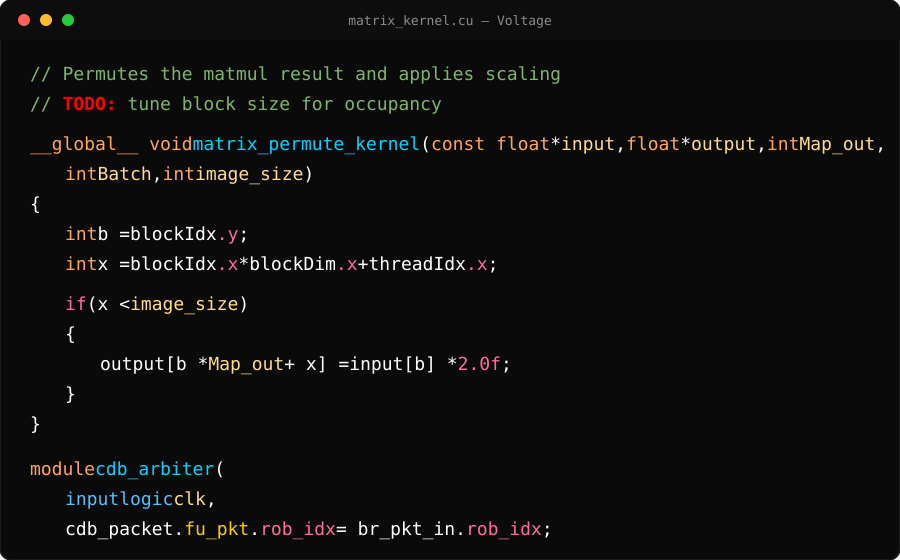
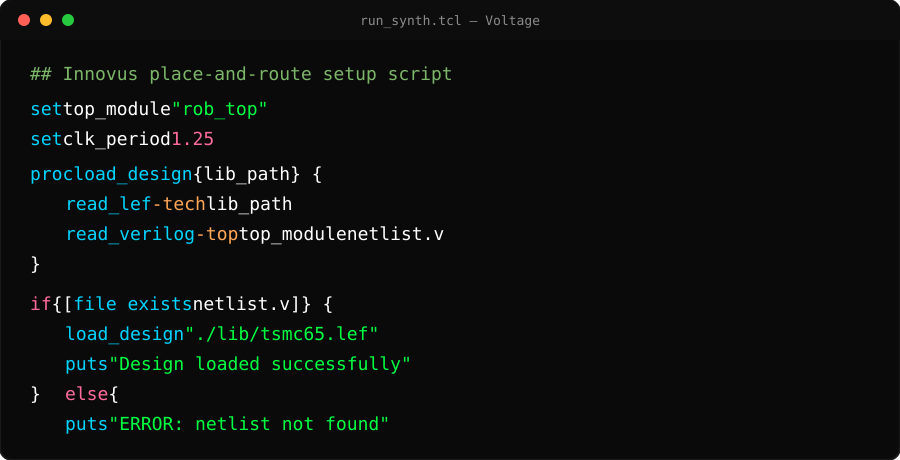

# Voltage

A high-contrast, vibrant dark theme for VS Code (built on top of **GitHub Dark Default**), plus my personal `.bashrc`.

No dimming, no washed-out "filter" look — dark background, rich color variety, and clear semantic distinctions between declarations, types, parameters, struct/signal access, and control flow.

  

## What's in this repo

- `settings.json` — the full VS Code color scheme (token colors + workbench colors)
- `.bashrc` — personal shell config
- `img/` — logo and preview images referenced in this README

## Installation

1. Install the **GitHub Dark Default** theme in VS Code (this is a set of overrides on top of it, not a standalone theme).
2. Copy the contents of `settings.json` into your VS Code `settings.json` (`Ctrl+Shift+P` → "Preferences: Open User Settings (JSON)").
   - If you already have settings in there, merge the keys rather than overwriting the whole file.

For `.bashrc`, just grab what you need and drop it into `~/.bashrc` — not meant to be dropped in wholesale.

## Color palette

| Element                                                                    | Hex       |                                                          |
| -------------------------------------------------------------------------- | --------- | -------------------------------------------------------- |
| Strings                                                                    | `#00ff41` |  |
| Numbers / control flow (`if`, `for`, etc.) / struct & signal member access | `#ff6b9d` |  |
| Types (`size_t`, classes, SV `logic`/`input`)                              | `#4fc1ff` |  |
| Declaration keywords (`const`, `int`, `void`)                              | `#ffa657` |  |
| Function declarations                                                      | `#00d4ff` |  |
| Function calls                                                             | `#82e2ff` |  |
| Function parameters                                                        | `#ffdd88` |  |
| Local variables                                                            | `#ffffff` |  |
| Enums & macros                                                             | `#ffcc00` |  |
| Comments                                                                   | `#7cb668` |  |
| TODO / FIXME tags                                                          | `#FF0000` |  |
| Cursor                                                                     | `#ff3333` |  |

Bracket pair colors cycle through gold, orchid, sky blue, tomato, mint, and light orange.

## Preview

**C / CUDA and SystemVerilog:**

  

**Tcl:**

  

**Python:**

  

> These previews are hand-built mockups approximating the real editor rendering, not actual screenshots — useful for a quick look, but worth swapping in real screenshots from your own setup if you want pixel-perfect accuracy.

## Language-specific notes

- **C/C++**: struct/object member access (e.g. `x` in `threadIdx.x`) is colored separately from the base identifier.
- **SystemVerilog**: port declarations (`input`, `output`, `logic`) follow the type/parameter color scheme; struct field access matches the C struct-access color; plain signals default to white.
- **Tcl**: commands match function color, variables are white, flags/options are orange, control keywords are pink-red.
- **Python**: `and` / `or` / `not` in conditionals get their own color (see `settings.json` for the current mapping).

## Why keep this in a repo?

VS Code settings usually sync automatically when signed into a personal GitHub account, so this is partly redundant day-to-day. It's here for the cases where that's not true — machines where you're logged into a different account, shared/lab machines, or anywhere you're not signed in at all. `.bashrc` isn't covered by Settings Sync at all, so it's worth keeping here regardless.

## Notes

This is a living theme — colors get adjusted as new languages or edge cases come up. Check the commit history for the latest tweaks.
