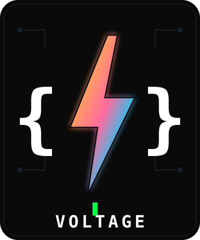
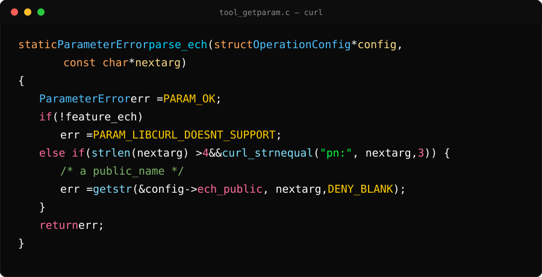
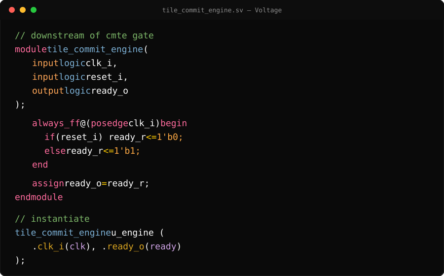
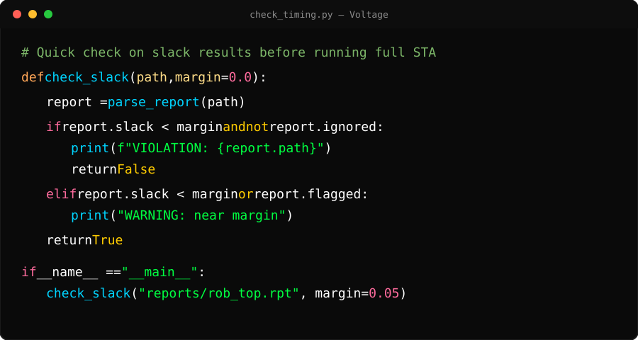
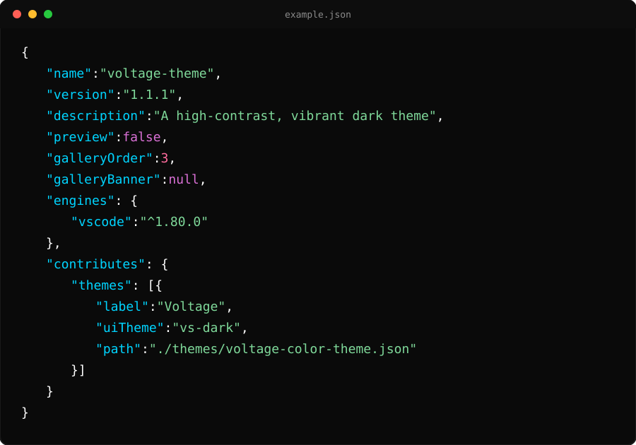

# Voltage

Voltage is a high-contrast, vibrant dark theme for VS Code, nano, Vim and Neovim, which I might expand to other tools as well. 

This project originated with my dissatisfaction with every color theme I seemed to find. I could never get the right combination of colors that I found to be helpful in identifying code and visually pleasing. 

So, I made **Voltage** - No dimming, no washed out colors, but a rich set of vibrant colors against a clean dark background with customization throughout for different languages. 

Voltage is available on the VSCode marketplace at -- https://marketplace.visualstudio.com/items?itemName=VerdantLeaf.voltage-theme

<p align="center">
  
</p>

## Structure

```
voltage/
├── vscode/
│   ├── package.json
│   └── themes/
│       └── voltage-color-theme.json
├── nano/
│   ├── install.sh
│   ├── VERSION
│   ├── voltage.nanorc
│   └── syntax/
├── vim/
│   ├── install.sh
│   ├── VERSION
│   └── colors/
│       └── voltage.vim
├── bash/
│   └── .bashrc
├── docs/
│   └── palette.md
├── img/
│   ├── voltage-logo.svg
│   ├── preview-c.svg
│   ├── preview-sv.svg
│   ├── preview-python.svg
│   └── preview-json.svg
├── LICENSE
└── README.md
```

Each tool gets its own top-level folder and its own releases. The palette itself is documented once, in `docs/palette.md`, rather than duplicated per app.

## Installation

**VS Code:**

Grab the packaged extension from [Releases](https://github.com/VerdantLeaf/voltage-theme/releases) and install it with:

```
code --install-extension voltage-theme-1.1.0.vsix
```

Or install manually from the file: `Ctrl+Shift+P` → "Extensions: Install from VSIX..." → select the `.vsix`.

Then `Ctrl+Shift+P` → "Preferences: Color Theme" → select **Voltage**.

To build the `.vsix` yourself:

```
cd vscode
npx @vscode/vsce package
```

The extension also adds syntax highlighting for nano config files (`.nanorc`), colored with the Voltage palette.

**Releasing (maintainers):** bump `version` in `vscode/package.json`, add a matching `## X.Y.Z` entry to `vscode/CHANGELOG.md`, and merge to `main`. A [GitHub Actions workflow](.github/workflows/release.yml) then packages the extension and publishes a GitHub Release with the `.vsix` attached automatically — no manual tagging needed.

**Recommended settings:**

I recommend extending the theme with rainbow bracket-pair guides. However, these need to be turned on by hand in your own `settings.json` (colorization itself, `editor.bracketPairColorization.enabled`, is already `true` by default in modern VS Code):

```json
{
  "editor.guides.bracketPairs": true
}
```

Voltage doesn't bundle its own file icons, but if you have the [Material Icon Theme](https://marketplace.visualstudio.com/items?itemName=PKief.material-icon-theme) extension installed, these are the folder/file tint colors used alongside Voltage:

```json
{
  "workbench.iconTheme": "material-icon-theme",
  "material-icon-theme.folders.color": "#F56600",
  "material-icon-theme.files.color": "#522DB0"
}
```

**nano:**

nano support is released separately from the VS Code extension (tags `nano-vX.Y.Z`), and the `.vsix` does not contain it. Download the tarball from [Releases](https://github.com/VerdantLeaf/voltage-theme/releases) and run the installer:

```
tar xzf voltage-nano-<version>.tar.gz
./voltage-nano-<version>/install.sh
```

Or, from a clone of this repo: `./nano/install.sh`.

The installer copies the theme to `~/.config/nano/voltage/` and adds a marked block to your `~/.nanorc` (or `~/.config/nano/nanorc` if that's the one you use) — it's safe to re-run to update, and `./install.sh --uninstall` removes it all. It gives you interface colors plus syntax highlighting for C/C++/CUDA, Python, SystemVerilog, Tcl/SDC, JSON, YAML, TOML, Markdown and shell.

Notes:

- nano can only use the terminal's 256-color palette, so each Voltage color is mapped to the nearest slot. For the best match, set your terminal background to `#0d1117`.
- nano older than 6.0 (e.g. 5.6 on RHEL 9) only understands named colors, so the installer picks the closest name instead. Upgrading nano gets you the closer match; re-run the installer afterward.
- nano uses regex rules, not a parser, so semantic distinctions (function parameters vs. locals, function declarations, SystemVerilog instance names) can't be reproduced. Everything that can be matched by pattern is.

**Releasing nano (maintainers):** bump `nano/VERSION`, add a matching `## X.Y.Z` entry to `nano/CHANGELOG.md`, and merge to `main`. [release-nano.yml](.github/workflows/release-nano.yml) publishes `nano-vX.Y.Z` with the tarball attached. It is not marked "latest", so `bash/update-voltage-theme.sh` keeps finding the VS Code release.

**Vim and Neovim:**

One colorscheme, `vim/colors/voltage.vim`, serves both editors and uses the exact Voltage hex colors, so it looks the same as the VS Code theme. Vim and Neovim are released separately from VS Code and nano (tags `vim-vX.Y.Z`). From a Linux shell:

```
gh release download --repo VerdantLeaf/voltage-theme --pattern 'voltage-vim-*.tar.gz'
tar xzf voltage-vim-*.tar.gz
./voltage-vim-*/install.sh
```

Or, from a clone of this repo: `./vim/install.sh`.

The installer detects Vim and/or Neovim (`--vim` / `--nvim` to pick one) and copies the scheme to `~/.vim/colors/` and `~/.config/nvim/colors/`. It then adds a marked block to your `~/.vimrc` and `init.vim` / `init.lua` that enables truecolor and runs `colorscheme voltage`. It is safe to re-run, and `./install.sh --uninstall` removes everything.

Notes:

- Voltage needs a **24-bit color terminal** (most modern ones; inside tmux, enable `Tc`/`RGB`). Without `termguicolors`, colors fall back to the nearest 256-color slot, which is close but not exact. Set your terminal background to `#0d1117` for the exact look.
- Neovim gets Treesitter and LSP semantic-token groups, so declarations, calls, parameters and struct members are colored separately like in VS Code. Plain Vim uses its regex syntax files; function calls and member access are added for C/C++/CUDA, Python and SystemVerilog, but parameters and declarations can't be told apart there.

**Releasing Vim/Neovim (maintainers):** bump `vim/VERSION`, add a matching `## X.Y.Z` entry to `vim/CHANGELOG.md`, and merge to `main`. [release-vim.yml](.github/workflows/release-vim.yml) publishes `vim-vX.Y.Z` with the tarball attached, not marked "latest".

**Bash:**
Grab what you'd like from `bash/.bashrc` and drop it into `~/.bashrc` — More for my personal uses

## Palette

See [`docs/palette.md`](docs/palette.md) for the full color table.

## Preview

**C** — excerpt from [curl](https://github.com/curl/curl):

<p align="center">
  
</p>

**SystemVerilog:**

<p align="center">
  
</p>

**Python** — excerpt from [omlx](https://github.com/jundot/omlx):

<p align="center">
  
</p>

**JSON:**

<p align="center">
  
</p>

## License

MIT — see [LICENSE](LICENSE).

## Notes

This is a living theme — colors get adjusted as new languages or edge cases come up. Check the commit history for the latest tweaks.
