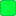

# Voltage Palette

| | Element | Hex |
|---|---|---|
|  | Strings | `#00ff41` |
|  | Numbers / control flow (`if`, `for`, etc.) / struct & signal member access | `#ff6b9d` |
|  | Types (`size_t`, classes, SV `logic`/`input`) | `#4fc1ff` |
|  | Declaration keywords (`const`, `int`, `void`) | `#ffa657` |
|  | Function declarations | `#00d4ff` |
|  | Function calls | `#82e2ff` |
|  | Function parameters | `#ffdd88` |
|  | Local variables | `#ffffff` |
|  | Enums & macros | `#ffcc00` |
|  | Comments | `#7cb668` |
|  | TODO / FIXME tags | `#FF0000` |
|  | Cursor | `#ff3333` |

Bracket pair colors cycle through:

|  gold `#ffd700` |  orchid `#da70d6` |  sky blue `#87ceeb` |  tomato `#ff6347` |  mint `#98fb98` |  light orange `#ffaa44` |
|---|---|---|---|---|---|

These colors are wired up via `editorBracketHighlight.foreground1-6` in the theme itself, but the vertical guide lines connecting bracket pairs are an editor setting, not a theme color, so they need `"editor.guides.bracketPairs": true` set by hand (see the main [README](../README.md#recommended-settings)).

## Language-specific notes

- **C/C++**: struct/object member access (e.g. `x` in `threadIdx.x`) is colored separately from the base identifier.
- **SystemVerilog**: port declarations (`input`, `output`, `logic`) follow the type/parameter color scheme; struct field access matches the C struct-access color; plain signals default to white.
- **Tcl**: commands match function color, variables are white, flags/options are orange, control keywords are pink-red.
- **Python**: `and` / `or` / `not` in conditionals get their own gold color (`#ffcc00`), matching enums/macros.
