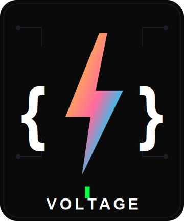
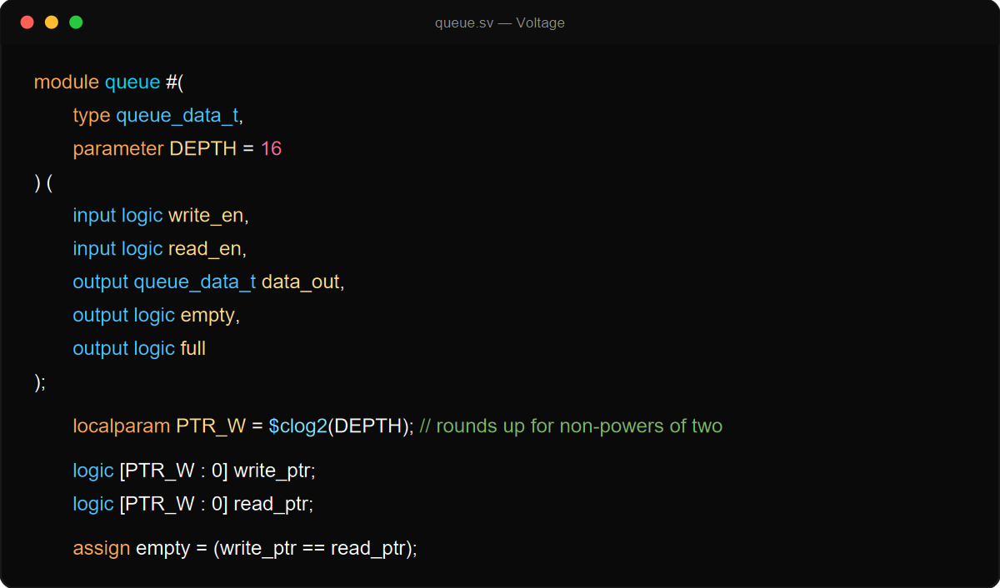

# Voltage

A high-contrast, vibrant dark theme with clear semantic distinctions between declarations, types, parameters, struct/signal access, and control flow.

<p align="center">
  
</p>

No dimming, no washed-out "filter" look — dark background, rich color variety, and syntax highlighting tuned for C/CUDA, SystemVerilog, Tcl, and Python.

## Preview

<p align="center">
  
</p>

## Install

`Ctrl+Shift+P` → "Preferences: Color Theme" → **Voltage**

For rainbow bracket-pair guides, also add this to your own `settings.json` — themes can set bracket *colors* but not this editor behavior toggle:

```json
{
  "editor.guides.bracketPairs": true
}
```

## Palette & full documentation

See the [project repository](https://github.com/VerdantLeaf/voltage-theme) for the full color palette, language-specific notes, and the bash dotfiles this repo also ships.

## License

MIT
